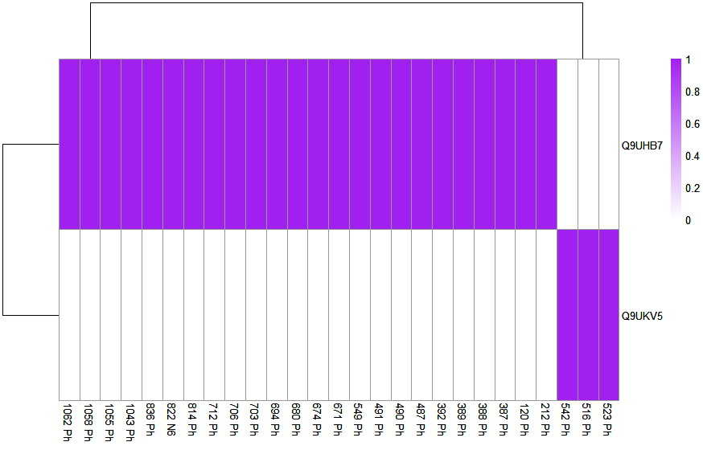
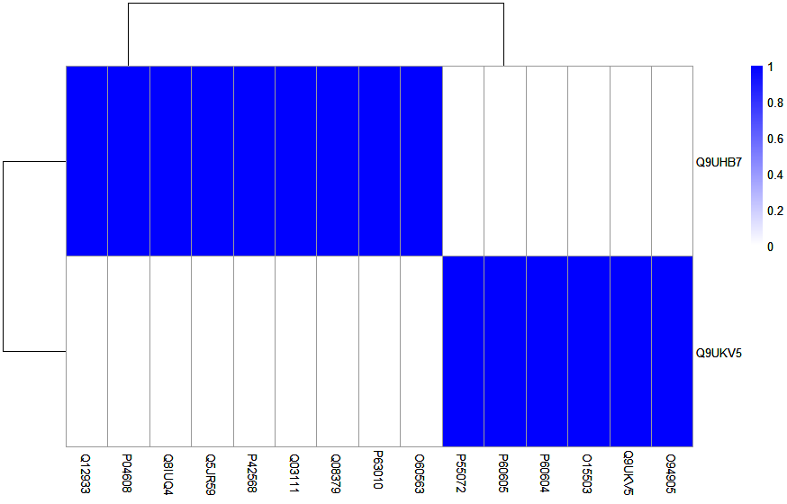
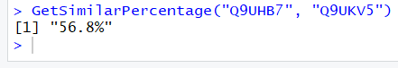
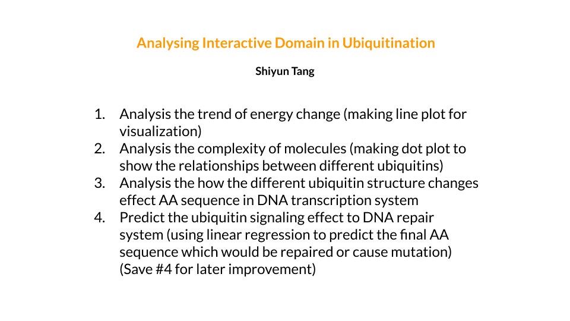

# Ubiquitin Analysis

The goal of Ubiquitin Analysis is to analysis the relationships between two different ubiquitin proteins.

## Installation
To install the latest version of the package:
``` r
require("devtools")
install_github("sealigu/UbiquitinAnalysis")
library("UbiquitinAnalysis")
```
To run the shinyApp:
```r
UbiquitinAnalysis::runUA()
```

## Overview
```r
browseVignettes("UbiquitinAnalysis")
```
This package contains 4 functions to demonstrate components of a simple R package.

### Function 1: PlotResModification()
```r
UbiquitinAnalysis::PlotResModification("Q9UHB7", "Q9UKV5")
```


Input two selected protein uniprot id (e.g. "Q9UHB7" and "Q9UKV5"), the output is a plot to show the amino acid modification position in the selected protein sequences. The output will help to compare whether these two proteins have the same modified position in both sequences.

### Function 2: PlotProteinInteractions()
```r
UbiquitinAnalysis::PlotProteinInteractions("Q9UHB7", "Q9UKV5")
```


Input two selected protein uniprot id (e.g. "Q9UHB7" and "Q9UKV5"), the output is a plot to show the interacting proteins of the selected proteins. The output will help to compare whether these two proteins have the same interacting protein.

### Function 3: GetSimilarPercentage()
```r
UbiquitinAnalysis::GetSimilarPercentage("Q9UHB7", "Q9UKV5")
```


Input two selected protein uniprot id (e.g. "Q9UHB7" and "Q9UKV5"), the output is a percentage number that shows the similarity of the two selected protein sequences.

# One-minute pitch slide


## Example
``` r
library(Ubiquitin Analysis);
lsf.str("package:UbiquitinAnalysis");

PlotResModification("Q9UHB7", "Q9UKV5");
PlotProteinInteractions("Q9UHB7", "Q9UKV5");
GetSimilarPercentage("Q9UHB7", "Q9UKV5");
```
- PlotResModification("Q9UHB7", "Q9UKV5")
- PlotProteinInteractions("Q9UHB7", "Q9UKV5")

The functions PlotResModification and PlotProteinInteractions were authored by Shiyun. Part of the code is used from StackOverFlow. The link and the authors are given in the code.

- GetSimilarPercentage("Q9UHB7", "Q9UKV5")

The function GetSimilarPercentage was authored by Shiyun. The Levenshtein distance algorithm was used to measuring the differences between two sequences.

- library(UniprotR)

The library UniprotR was used to retrieve data from UniProt services.

## References
